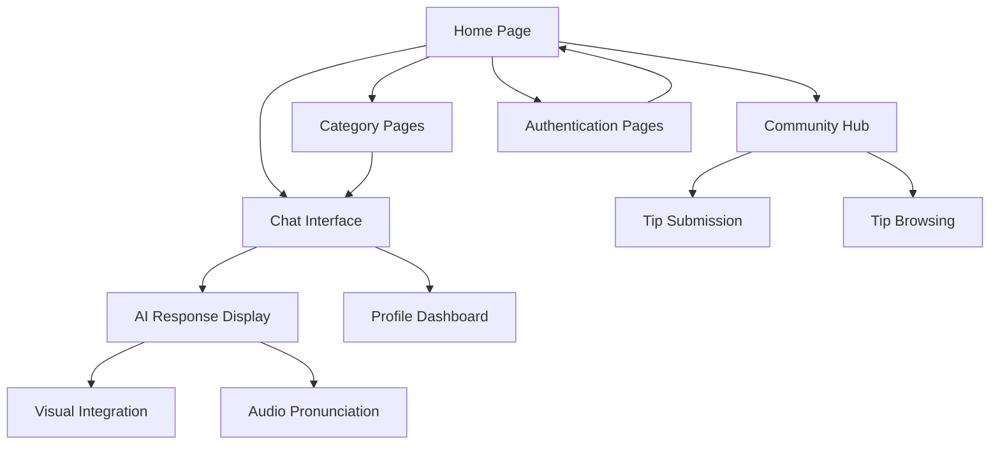

# ByteFriend - Product Requirements Document

## 1. Product Overview

ByteFriend is an AI-powered web companion designed to help newcomers settle into life in Japan through friendly conversation, practical guidance, and AI-generated visuals. The platform combines administrative task assistance with cultural insights to make the transition to Japanese life smoother and more emotionally supportive.

The product addresses the complex challenges faced by international residents in Japan by providing step-by-step guidance for essential tasks like address registration, banking, and phone setup, while fostering cultural understanding through community-shared experiences and localized tips.

ByteFriend aims to become the go-to digital companion for Japan's growing international community, leveraging BytePlus AI services to deliver personalized, culturally-aware assistance.

## 2. Core Features

### 2.1 User Roles

| Role | Registration Method | Core Permissions |
|------|---------------------|------------------|
| Guest User | No registration required | Can browse content, ask basic questions, view community tips |
| Registered User | Email registration | Can save conversations, contribute tips, access personalized recommendations, use voice features |
| Community Contributor | Verified user status | Can moderate community tips, create featured content, access analytics |

### 2.2 Feature Module

Our ByteFriend application consists of the following main pages:

1. **Home Page**: Welcome hero section with quick access categories, featured community tips, and chat interface entry point.
2. **Chat Interface**: Main conversational AI interaction area with integrated visual and audio responses.
3. **Category Pages**: Dedicated sections for Living, Phone & Internet, Banking, University Life, and Culture topics.
4. **Community Hub**: User-contributed tips sharing, tip visualization, and community interaction features.
5. **Profile Dashboard**: User conversation history, saved tips, personal preferences, and account settings.
6. **Authentication Pages**: Login and registration forms with social authentication options.

### 2.3 Page Details

| Page Name | Module Name | Feature description |
|-----------|-------------|---------------------|
| Home Page | Hero Section | Display welcoming message with ByteFriend mascot, quick category navigation buttons, and featured daily tip |
| Home Page | Category Quick Access | Show 5 main category cards (Living, Phone & Internet, Banking, University Life, Culture) with icons and brief descriptions |
| Home Page | Featured Tips | Display 3-4 community-contributed tips with visual summaries and engagement metrics |
| Chat Interface | Message Input | Provide text input field with voice-to-text capability and suggested question prompts |
| Chat Interface | AI Response Display | Show structured responses with Steps, Cultural Context, Visual, and Key Japanese Terms sections |
| Chat Interface | Visual Integration | Display AI-generated illustrations from Seedream API with loading states and error handling |
| Chat Interface | Audio Pronunciation | Play Japanese word pronunciations using Seed Speech API with phonetic text display |
| Chat Interface | Conversation History | Save and display previous chat sessions with search and filter capabilities |
| Category Pages | Topic Navigation | List common questions and scenarios within each category with difficulty indicators |
| Category Pages | Quick Guides | Provide pre-generated step-by-step guides for frequent tasks with visual aids |
| Category Pages | Related Tips | Show community tips relevant to the current category with rating system |
| Community Hub | Tip Submission | Allow users to submit personal experiences with text editor and optional image upload |
| Community Hub | Tip Visualization | Generate AI summaries and visuals for new community tips using ModelArk and Seedream |
| Community Hub | Tip Browsing | Display tips with filtering by category, popularity, and recency with search functionality |
| Community Hub | Engagement Features | Enable tip rating, commenting, and sharing with social media integration |
| Profile Dashboard | Conversation Archive | Store and organize user chat history with export options and search capabilities |
| Profile Dashboard | Saved Content | Bookmark useful tips and responses with personal notes and categorization |
| Profile Dashboard | Preferences | Configure language settings, notification preferences, and AI response customization |
| Authentication Pages | Login Form | Email/password authentication with social login options (Google, Apple) |
| Authentication Pages | Registration Form | User signup with email verification and terms acceptance |

## 3. Core Process

**Guest User Flow:**
Users can immediately access ByteFriend's chat interface and browse community tips without registration. They can ask questions about life in Japan and receive AI-generated responses with cultural context and visuals. However, conversation history and personalization features require account creation.

**Registered User Flow:**
After registration, users gain access to personalized features including conversation history, saved tips, and the ability to contribute to the community. They can customize their experience based on their specific situation (student, worker, tourist) and receive tailored recommendations.

**Community Contributor Flow:**
Experienced users can share their own tips and experiences, which are then processed by AI to generate summaries and visuals. Contributors can moderate content and access analytics about their contributions' impact on the community.

**Main AI Interaction Flow:**
1. User submits question or selects topic
2. ModelArk LLM generates practical steps and cultural insights
3. Seedream creates relevant visual illustration
4. Seed Speech provides pronunciation for key Japanese terms
5. Combined response displayed with interactive elements

## 4. User Interface Design

### 4.1 Design Style

- **Primary Colors**: Navy blue (#1B365D) for headers and primary actions, warm beige (#F5F1E8) for backgrounds
- **Secondary Colors**: Soft red (#E74C3C) for accents and notifications, light gray (#F8F9FA) for cards
- **Button Style**: Rounded corners (8px radius) with subtle shadows, gradient effects for primary actions
- **Typography**: Clean sans-serif font (Inter or similar), 16px base size, 24px for headings, 14px for secondary text
- **Layout Style**: Card-based design with generous white space, floating chat bubbles for conversations
- **Icons**: Minimalist Japanese-inspired icons with cultural elements, emoji integration for warmth and friendliness

### 4.2 Page Design Overview

| Page Name | Module Name | UI Elements |
|-----------|-------------|-------------|
| Home Page | Hero Section | Large ByteFriend mascot illustration, gradient background (navy to beige), centered welcome text with animated typing effect |
| Home Page | Category Cards | 5 cards in grid layout, each with category icon, title, and brief description, hover effects with subtle elevation |
| Chat Interface | Message Bubbles | User messages in navy bubbles (right-aligned), AI responses in beige bubbles (left-aligned) with structured content sections |
| Chat Interface | Visual Display | Centered image cards with rounded corners, loading skeleton animations, zoom functionality |
| Category Pages | Topic Lists | Accordion-style expandable sections, difficulty badges (Beginner/Intermediate/Advanced), progress indicators |
| Community Hub | Tip Cards | Pinterest-style masonry layout, user avatars, engagement metrics, category tags with color coding |
| Profile Dashboard | Navigation Tabs | Horizontal tab navigation, clean data tables, export buttons with download icons |

### 4.3 Responsiveness

The application is designed mobile-first with responsive breakpoints at 768px (tablet) and 1024px (desktop). Touch interactions are optimized for mobile users, with larger tap targets and swipe gestures for navigation. The chat interface adapts to different screen sizes while maintaining readability and usability across all devices.