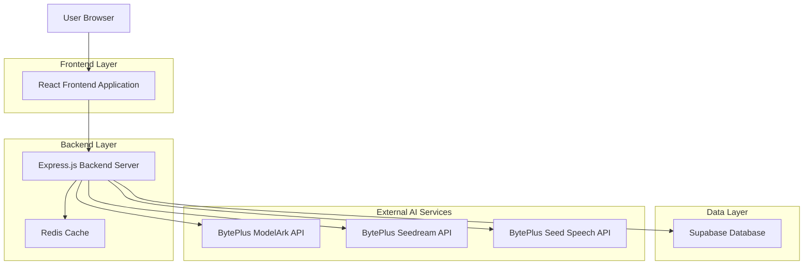
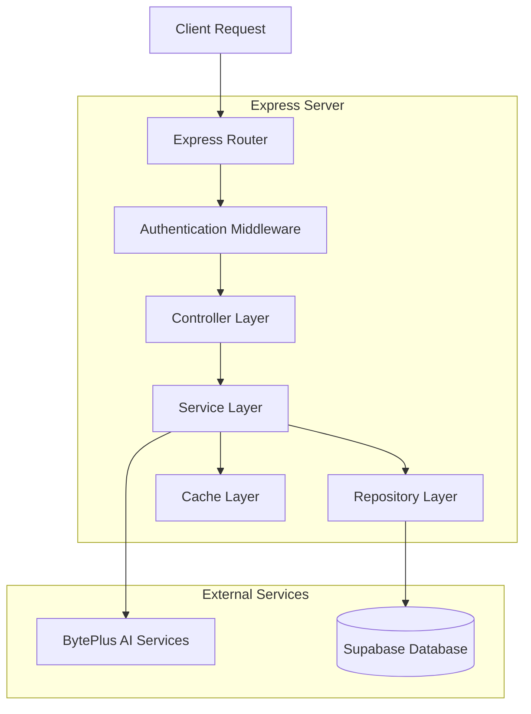
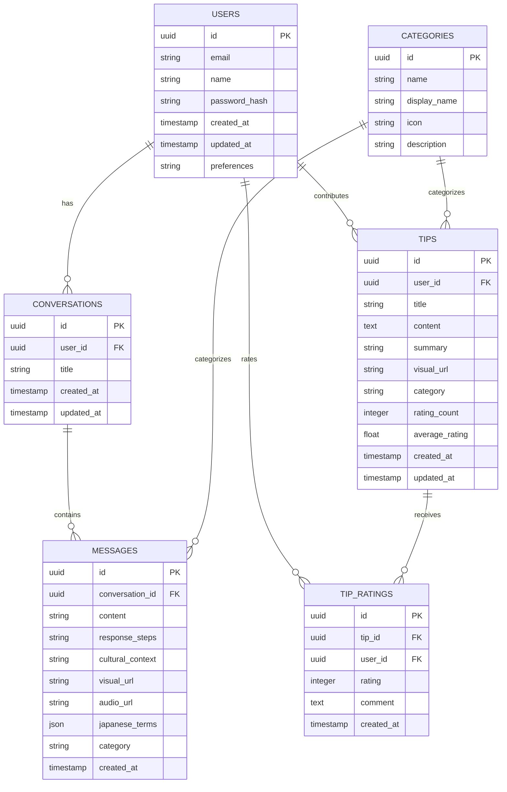

# ByteFriend - Technical Architecture Document

## 1. Architecture Design



## 2. Technology Description

* Frontend: React\@18 + TypeScript + Tailwind CSS\@3 + Vite

* Backend: Express.js\@4 + TypeScript + Node.js\@18

* Database: Supabase (PostgreSQL)

* Cache: Redis\@7

* AI Services: BytePlus ModelArk, Seedream, Seed Speech APIs

## 3. Route Definitions

| Route                   | Purpose                                              |
| ----------------------- | ---------------------------------------------------- |
| /                       | Home page with category navigation and featured tips |
| /chat                   | Main chat interface for AI conversations             |
| /category/:categoryName | Category-specific pages (living, banking, etc.)      |
| /community              | Community hub for user-contributed tips              |
| /community/submit       | Tip submission form                                  |
| /profile                | User profile dashboard with conversation history     |
| /login                  | User authentication login page                       |
| /register               | User registration page                               |
| /tip/:tipId             | Individual tip detail view                           |

## 4. API Definitions

### 4.1 Core API

**Chat and AI Integration**

```
POST /api/chat/message
```

Request:

| Param Name | Param Type | isRequired | Description                 |
| ---------- | ---------- | ---------- | --------------------------- |
| message    | string     | true       | User's question or input    |
| category   | string     | false      | Topic category for context  |
| userId     | string     | false      | User ID for personalization |

Response:

| Param Name      | Param Type | Description                          |
| --------------- | ---------- | ------------------------------------ |
| steps           | string     | Step-by-step practical guidance      |
| culturalContext | string     | Cultural insight and local tips      |
| visualUrl       | string     | Generated illustration URL           |
| audioUrl        | string     | Pronunciation audio URL              |
| japaneseTerms   | array      | Key Japanese terms with romanization |

Example:

```json
{
  "message": "How do I register my address in Japan?",
  "category": "living"
}
```

**Community Tips Management**

```
POST /api/tips
```

Request:

| Param Name | Param Type | isRequired | Description             |
| ---------- | ---------- | ---------- | ----------------------- |
| title      | string     | true       | Tip title               |
| content    | string     | true       | Tip content             |
| category   | string     | true       | Category classification |
| userId     | string     | true       | Contributing user ID    |

Response:

| Param Name | Param Type | Description          |
| ---------- | ---------- | -------------------- |
| tipId      | string     | Generated tip ID     |
| summary    | string     | AI-generated summary |
| visualUrl  | string     | Generated visual URL |
| status     | string     | Processing status    |

**User Authentication**

```
POST /api/auth/register
```

Request:

| Param Name | Param Type | isRequired | Description        |
| ---------- | ---------- | ---------- | ------------------ |
| email      | string     | true       | User email address |
| password   | string     | true       | User password      |
| name       | string     | true       | Display name       |

Response:

| Param Name | Param Type | Description              |
| ---------- | ---------- | ------------------------ |
| user       | object     | User profile data        |
| token      | string     | JWT authentication token |

## 5. Server Architecture Diagram



## 6. Data Model

### 6.1 Data Model Definition



### 6.2 Data Definition Language

**Users Table**

```sql
-- Create users table
CREATE TABLE users (
    id UUID PRIMARY KEY DEFAULT gen_random_uuid(),
    email VARCHAR(255) UNIQUE NOT NULL,
    name VARCHAR(100) NOT NULL,
    password_hash VARCHAR(255) NOT NULL,
    preferences JSONB DEFAULT '{}',
    created_at TIMESTAMP WITH TIME ZONE DEFAULT NOW(),
    updated_at TIMESTAMP WITH TIME ZONE DEFAULT NOW()
);

-- Create index
CREATE INDEX idx_users_email ON users(email);

-- Grant permissions
GRANT SELECT ON users TO anon;
GRANT ALL PRIVILEGES ON users TO authenticated;
```

**Conversations Table**

```sql
-- Create conversations table
CREATE TABLE conversations (
    id UUID PRIMARY KEY DEFAULT gen_random_uuid(),
    user_id UUID REFERENCES users(id) ON DELETE CASCADE,
    title VARCHAR(255) NOT NULL,
    created_at TIMESTAMP WITH TIME ZONE DEFAULT NOW(),
    updated_at TIMESTAMP WITH TIME ZONE DEFAULT NOW()
);

-- Create indexes
CREATE INDEX idx_conversations_user_id ON conversations(user_id);
CREATE INDEX idx_conversations_created_at ON conversations(created_at DESC);

-- Grant permissions
GRANT SELECT ON conversations TO anon;
GRANT ALL PRIVILEGES ON conversations TO authenticated;
```

**Messages Table**

```sql
-- Create messages table
CREATE TABLE messages (
    id UUID PRIMARY KEY DEFAULT gen_random_uuid(),
    conversation_id UUID REFERENCES conversations(id) ON DELETE CASCADE,
    content TEXT NOT NULL,
    response_steps TEXT,
    cultural_context TEXT,
    visual_url VARCHAR(500),
    audio_url VARCHAR(500),
    japanese_terms JSONB DEFAULT '[]',
    category VARCHAR(50),
    created_at TIMESTAMP WITH TIME ZONE DEFAULT NOW()
);

-- Create indexes
CREATE INDEX idx_messages_conversation_id ON messages(conversation_id);
CREATE INDEX idx_messages_category ON messages(category);
CREATE INDEX idx_messages_created_at ON messages(created_at DESC);

-- Grant permissions
GRANT SELECT ON messages TO anon;
GRANT ALL PRIVILEGES ON messages TO authenticated;
```

**Tips Table**

```sql
-- Create tips table
CREATE TABLE tips (
    id UUID PRIMARY KEY DEFAULT gen_random_uuid(),
    user_id UUID REFERENCES users(id) ON DELETE CASCADE,
    title VARCHAR(255) NOT NULL,
    content TEXT NOT NULL,
    summary TEXT,
    visual_url VARCHAR(500),
    category VARCHAR(50) NOT NULL,
    rating_count INTEGER DEFAULT 0,
    average_rating DECIMAL(3,2) DEFAULT 0.00,
    created_at TIMESTAMP WITH TIME ZONE DEFAULT NOW(),
    updated_at TIMESTAMP WITH TIME ZONE DEFAULT NOW()
);

-- Create indexes
CREATE INDEX idx_tips_user_id ON tips(user_id);
CREATE INDEX idx_tips_category ON tips(category);
CREATE INDEX idx_tips_average_rating ON tips(average_rating DESC);
CREATE INDEX idx_tips_created_at ON tips(created_at DESC);

-- Grant permissions
GRANT SELECT ON tips TO anon;
GRANT ALL PRIVILEGES ON tips TO authenticated;
```

**Categories Table**

```sql
-- Create categories table
CREATE TABLE categories (
    id UUID PRIMARY KEY DEFAULT gen_random_uuid(),
    name VARCHAR(50) UNIQUE NOT NULL,
    display_name VARCHAR(100) NOT NULL,
    icon VARCHAR(100),
    description TEXT
);

-- Create index
CREATE INDEX idx_categories_name ON categories(name);

-- Grant permissions
GRANT SELECT ON categories TO anon;
GRANT ALL PRIVILEGES ON categories TO authenticated;

-- Insert initial data
INSERT INTO categories (name, display_name, icon, description) VALUES
('living', '🏠 Living', 'home', 'Housing, address registration, utilities, and daily life essentials'),
('phone-internet', '📱 Phone & Internet', 'smartphone', 'Mobile plans, SIM cards, internet setup, and digital services'),
('banking', '💰 Banking', 'credit-card', 'Bank accounts, credit cards, money transfers, and financial services'),
('university', '🏫 University Life', 'graduation-cap', 'Student life, campus resources, academic procedures, and study tips'),
('culture', '🎌 Culture', 'torii-gate', 'Japanese customs, etiquette, festivals, and cultural understanding');
```

**Tip Ratings Table**

```sql
-- Create tip_ratings table
CREATE TABLE tip_ratings (
    id UUID PRIMARY KEY DEFAULT gen_random_uuid(),
    tip_id UUID REFERENCES tips(id) ON DELETE CASCADE,
    user_id UUID REFERENCES users(id) ON DELETE CASCADE,
    rating INTEGER CHECK (rating >= 1 AND rating <= 5),
    comment TEXT,
    created_at TIMESTAMP WITH TIME ZONE DEFAULT NOW(),
    UNIQUE(tip_id, user_id)
);

-- Create indexes
CREATE INDEX idx_tip_ratings_tip_id ON tip_ratings(tip_id);
CREATE INDEX idx_tip_ratings_user_id ON tip_ratings(user_id);

-- Grant permissions
GRANT SELECT ON tip_ratings TO anon;
GRANT ALL PRIVILEGES ON tip_ratings TO authenticated;
```

